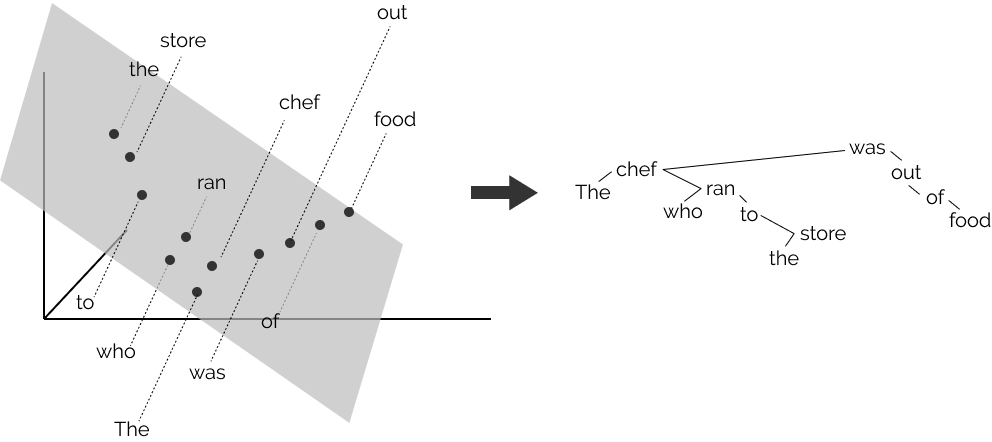
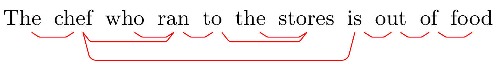
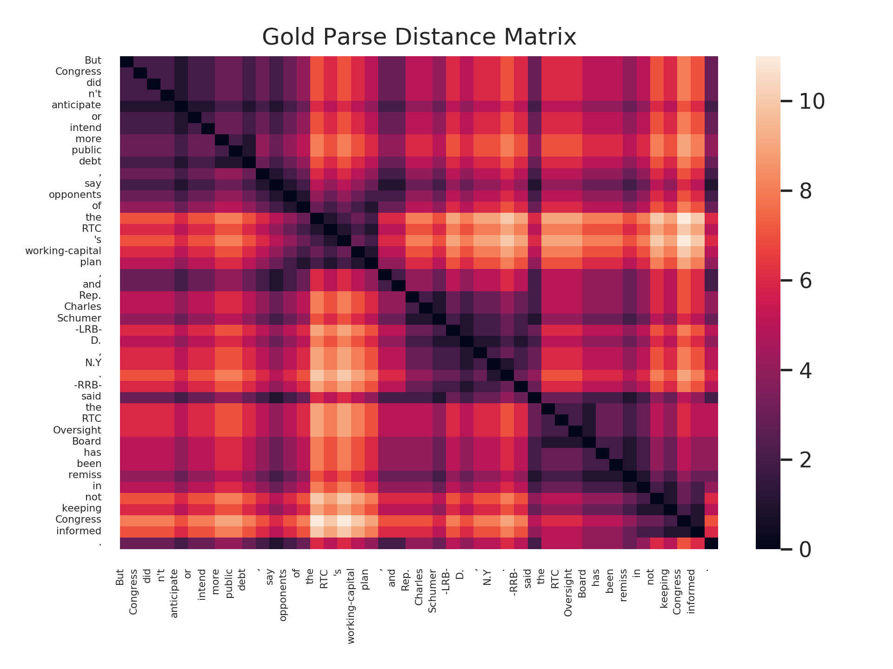
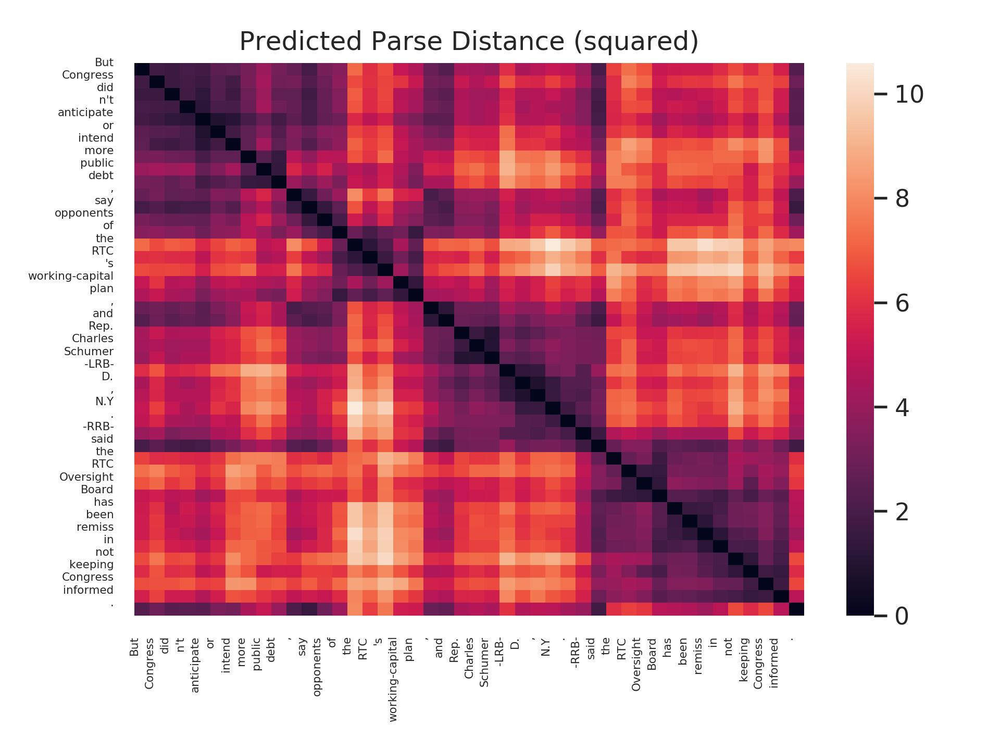

<p align="center">
  
</p>

# structural-probes

Codebase for testing whether hidden states of neural networks encode discrete structures.

Based on the paper [A Structural Probe for Finding Syntax in Word Representations](https://nlp.stanford.edu/pubs/hewitt2019structural.pdf).

See the [blog post on structural probes](https://nlp.stanford.edu//~johnhew//structural-probe.html) for a brief introduction.

## Installing & Getting Started

1. Clone the repository.

        git clone https://github.com/john-hewitt/structural-probes/
        cd structural-probes
        
1. [Optional] Construct a virtual environment for this project. Only `python3` is supported.

        conda create --name sp-env
        conda activate sp-env

1. Install the required packages. This mainly means `pytorch`, `scipy`, `numpy`, `seaborn`, etc. 
   Look at [pytorch.org](https://pytorch.org) for the PyTorch installation that suits you and install it; it won't be installed via `requirements.txt`.
   Everything in the repository will use a GPU if available, but if none is available, it will detect so and just use the CPU, so use the pytorch install of your choice. 

        conda install --file requirements.txt
        pip install pytorch-pretrained-bert
        
1. Download some pre-packaged data from the [English Universal Dependencies (EWT) dataset](https://universaldependencies.org/treebanks/en_ewt/index.html) and pretrained probes to get your feet wet.

        bash ./download_example.sh
  
    This will make the directory `example/data`, and in it will be 9 files, 3 for each of train,dev,test.
     - `en_ewt-ud-{train,dev,test}.conllu`: the parsed language data
     - `en_ewt-ud-{train,dev,test}.txt`: whitespace-tokenized, sentence-per-line language data.
     - `en_ewt-ud-{train,dev,test}.elmo-layers.hdf5`: the ELMo hidden states for each sentence of the language data, constructed by running elmo on the `.txt` files.

1. Test a pre-trained structural probe on `BERTlarge` with our demo script!

        printf "The chef that went to the stores was out of food" | python structural-probes/run_demo.py example/demo-bert.yaml
   
   The script will make a new directory under `example/results/` and store some neat visualizations there.
   It will use pre-trained probe parameters stored at `example/data`, downloaded with `download_example.sh`.
   Try out some other sentences too! 

1. Run an experiment using an example experiment configuration, and take a look at the resultant reporting!

        python structural-probes/run_experiment.py example/config/prd_en_ewt-ud-sample.yaml
        
   The path to a new directory containing the results of the experiment will be in the first few lines of the logging output of the script. Once you go there, you can see dev-pred*.png: some distance matrices printed by the script, as well as files containing the quantitative reporting results, like `dev.uuas`, the unlabeled undirected attachment score. These will all be very low, since the probe was trained on very little data!

## Run a pretrained structural probe on `BERT-large` quickly on the command line.

It's easy to get predictions on a sentence (or file of sentences) using our demo script and the pre-trained structural probes we release. We use `pytorch-pretrained-bert` to get BERT subword embeddings for each sentence; it should be installed during setup of the repository.

Make sure you've run `download_example.sh`; this will download two probe parameter files to `example/data/`.
Also make sure you've installed all dependencies.
One is a distance probe on the 16th hidden layer of BERT large, and the other is a depth probe on the same layer.
The configuration file `example/demo-bert.yaml` has the right paths already plugged in; just pipe text into the demo file, as follows:

     printf "The chef that went to the stores was out of food" | python structural-probes/run_demo.py example/demo-bert.yaml

If you want to run multiple sentences at once, you can either do so via `printf`:
     
     printf "The chef that went to the stores was out of food\nThe chef that went to the stores and talked to the parents was out of food" | python structural-probes/run_demo.py example/demo-bert.yaml
     
Or piping/redirecting a file to stdin:

     cat my_set.txt | python structural-probes/run_demo.py example/demo-bert.yaml
     
The script will print out a directory to which it has written visualizations of both parse depths and parse distances as predicted by a distance probe and a depth probe.
You'll also see `demo.tikz`, which is a bit of LaTeX for the `tikz-dependency` package.
With `tikz-dependency` in the same directory as your LaTeX file, you can plop this bit of LaTeX in a `figure` environment and see the minimum spanning tree it constructs. It'd look a bit like this:

    \documentclass{article}
    \usepackage{tikz-dependency}
    \usepackage{tikz}
    
    \pgfkeys{%
    /depgraph/reserved/edge style/.style = {% 
    white, -, >=stealth, % arrow properties                                                                            
    black, solid, line cap=round, % line properties
    rounded corners=2, % make corners round
    },%
    }
    \begin{document}
    \begin{figure}
      \centering
      \small
      \begin{dependency}[hide label, edge unit distance=.5ex]
        \begin{deptext}[column sep=0.05cm]
          The\& chef\& who\& ran\& to\& the\& stores\& is\& out\& of\& food \\
        \end{deptext}                                                                                                                                                                                                                           
        \depedge[edge style={red}, edge below]{8}{9}{.}
        \depedge[edge style={red}, edge below]{5}{7}{.}
        \depedge[edge style={red}, edge below]{4}{5}{.}
        \depedge[edge style={red}, edge below]{1}{2}{.}
        \depedge[edge style={red}, edge below]{6}{7}{.}
        \depedge[edge style={red}, edge below]{9}{10}{.}
        \depedge[edge style={red}, edge below]{10}{11}{.}
        \depedge[edge style={red}, edge below]{3}{4}{.}
        \depedge[edge style={red}, edge below]{2}{4}{.}
        \depedge[edge style={red}, edge below]{2}{8}{.}
      \end{dependency}
    \end{figure}
    \end{document}

Which results in a PDF with the following:

<p align="center">
  
</p>
     
Note that your text should be whitespace-tokenized! 
If you want to evaluate on a test set with gold parses, or if you want to train your own structural probes, read on.

## The experiment config file
Experiments run with this repository are specified via `yaml` files that completely describe the experiment (except the random seed.)
In this section, we go over each top-level key of the experiment config.

### Dataset:
 - `observation_fieldnames`: the fields (columns) of the conll-formatted corpus files to be used.
   Must be in the same order as the columns of the corpus.
   Each field will be accessable as an attribute of each `Observation` class (e.g., `observation.sentence`
   contains the sequence of tokens comprising the sentence.)
 - `corpus`: The location of the train, dev, and test conll-formatted corpora files. Each of `train_path`,
   `dev_path`, `test_path` will be taken as relative to the `root` field.
 - `embeddings`: The location of the train, dev, and test pre-computed embedding files (ignored if not applicable.
 Each of `train_path`, `dev_path`, `test_path` will be taken as relative to the `root` field.
        - `type` is ignored.
 - `batch_size`: The number of observations to put into each batch for training the probe. 20 or so should be great.
```
dataset:
  observation_fieldnames:
     - index
     - sentence
     - lemma_sentence
     - upos_sentence
     - xpos_sentence
     - morph
     - head_indices
     - governance_relations
     - secondary_relations
     - extra_info
     - embeddings
  corpus:
    root: example/data/en_ewt-ud-sample/
    train_path: en_ewt-ud-train.conllu
    dev_path: en_ewt-ud-dev.conllu
    test_path: en_ewt-ud-test.conllu
  embeddings:
    type: token #{token,subword}
    root: example/data/en_ewt-ud-sample/ 
    train_path: en_ewt-ud-train.elmo-layers.hdf5
    dev_path: en_ewt-ud-dev.elmo-layers.hdf5
    test_path: en_ewt-ud-test.elmo-layers.hdf5
  batch_size: 40
```
### Model
 - `hidden_dim`: The dimensionality of the representations to be probed.
    The probe parameters constructed will be of shape (hidden_dim, maximum_rank)
 - `embedding_dim`: ignored
 - `model_type`: One of `ELMo-disk`, `BERT-disk`, `ELMo-decay`, `ELMo-random-projection` as of now. 
   Used to help determine which `Dataset` class should be constructed, as well as which model will construct the representations for the probe.
   The `Decay0` and `Proj0` baselines in the paper are from `ELMo-decay` and `ELMo-random-projection`, respectively.
   In the future, will be used to specify other PyTorch models.
 - `use_disk`: Set to `True` to assume that pre-computed embeddings should be stored with each `Observation`; Set to `False` to use the words in some downstream model (this is not supported yet...)
 - `model_layer`: The index of the hidden layer to be used by the probe. For example, `ELMo` models can use layers `0,1,2`; BERT-base models have layers `0` through `11`; BERT-large `0` through `23`.
 - `tokenizer`: If a model will be used to construct representations on the fly (as opposed to using embeddings saved to disk) then a tokenizer will be needed. The `type` string will specify the kind of tokenizer used.
 The `vocab_path` is the absolute path to a vocabulary file to be used by the tokenizer.
```
model:
  hidden_dim: 1024 # ELMo hidden dim
  #embedding_dim: 1024 # ELMo word embedding dim
  model_type: ELMo-disk # BERT-disk, ELMo-disk,
  tokenizer:
    type: word
    vocab_path: example/vocab.vocab
  use_disk: True
  model_layer: 2 # BERT-base: {1,...,12}; ELMo: {1,2,3}
```

### Probe, probe-training
 - `task_signature`: Specifies the function signature of the task.
 Currently, can be either `word`, for parse depth (or perhaps labeling) tasks; or `word_pair` for parse distance tasks.
 - `task_name`: A unique name for each task supported by the repository. Right now, this includes `parse-depth` and `parse-distance`.
 - `maximum_rank`: Specifies the dimensionality of the space to be projected into, if `psd_parameters=True`.
   The projection matrix is of shape (hidden_dim, maximum_rank).
   The rank of the subspace is upper-bounded by this value.
   If `psd_parameters=False`, then this is ignored.
 - `psd_parameters`: though not reported in the paper, the `parse_distance` and `parse_depth` tasks can be accomplished with a non-PSD matrix inside the quadratic form.
   All experiments for the paper were run with `psd_parameters=True`, but setting `psd_parameters=False` will simply construct a square parameter matrix. See the docstring of `probe.TwoWordNonPSDProbe` and `probe.OneWordNonPSDProbe` for more info. 
 - `diagonal`: Ignored.
 - `prams_path`: The path, relative to `args['reporting']['root']`, to which to save the probe parameters.
 - `epochs`: The maximum number of epochs to which to train the probe. 
   (Regardless, early stopping is performed on the development loss.)
 - `loss`: A string to specify the loss class. Right now, only `L1` is available.
    The class within `loss.py` will be specified by a combination of this and the task name, since for example distances and depths have different special requirements for their loss functions.
```
probe:
  task_signature: word_pair # word, word_pair
  task_name: parse-distance
  maximum_rank: 32
  psd_parameters: True
  diagonal: False
  params_path: predictor.params
probe_training:
  epochs: 30
  loss: L1
```

### Reporting
 - `root`: The path to the directory in which a new subdirectory should be constructed for the results of this experiment.
 - `observation_paths`: The paths, relative to `root`, to which to write the observations formatted for quick reporting later on.
 - `prediction_paths`: The paths, relative to `root`, to which to write the predictions of the model.
 - `reporting_methods`: A list of strings specifying the methods to use to report and visualize results from the experiment.
    For `parse-distance`, the valid methods are `spearmanr`, `uuas`, `write_predictions`, and `image_examples`. 
    When reporting `uuas`, some `tikz-dependency` examples are written to disk as well.
    For `parse-depth`, the valid methods are `spearmanr`, `root_acc`, `write_predictions`, and `image_examples`.
    Note that `image_examples` will be ignored for the test set.
```
reporting:
  root: example/results
  observation_paths:
    train_path: train.observations
    dev_path: dev.observations
    test_path: test.observations
  prediction_paths:
    train_path: train.predictions
    dev_path: dev.predictions
    test_path: test.predictions
  reporting_methods:
    - spearmanr
      #- image_examples
    - uuas
```

## Reporting + visualization

It can be time-consuming to make nice visualizations and make sense of the results from a probing experiment, so this repository does a bit of work for you. This section goes over each of the reporting methods available (under `args['reporting']['reporting_methods']` in the experiment config), and exmaples of results.

- `spearmanr`: This reporting method calculates the spearman correlation between predicted (distances/depths) and true (distances/depths) as defined by gold parse trees.
  See the paper or `reporting.py` docstrings for specifics.
  With this option enabled, you'll see `dev.spearmanr`, a TSV with an average Spearman correlation for each sentence length represented in the dev set, as well as `dev.spearmanr-5-50-mean`, which averages the sentence-average values for all sentence lengths between 5 and 50 (inclusive.)
- `image_examples`: This reporting method prints out true and predicted distance matrices as `png`s for the first 20 examples in the split. These will be labeled `dev-pred0.png`, `dev-gold0.png`, etc. They'll look something like this:

<p align="center">
  
         
</p>

- `uuas`: This reporting method (only used by `parse-distance` tasks) will print the unlabeled undirected attachment score to `dev.uuas`, and write the first 20 development examples' minimum spanning trees (for both gold and predicted distance matrices) in a `tikz-dependency` LaTeX code format, to `dev.tikz`.
  Each sentence can be copy-pasted into a LaTeX doc for visualization. Then they'l look something like this:
  <p align="center">
  
</p>
  
- `root_acc`: This reporting method (only used by `parse-depth` tasks) will print to `dev.root_acc` the percentage of sentences where the least-deep word in the gold tree (the root) is also the least-deep according to the predicted depths.

## Replicating PTB Results for the NAACL'19 Paper
As usual with the PTB, a bit of work has to be done in prepping data (and you have to have the unadulterated PTB data already, not the mangled language modeling benchmark version.)
 
To replicate our results on the PTB, you'll have to prep some data files.
The prep scripts will need to be modified to use paths on your system, but the process is as follows:

1. Have Stanford CoreNLP installed / on your java `classpath`, and have `allennlp` installed.
1. Convert the PTB constituency trees to Stanford Dependencies in `conllx` format, using the script `scripts/convert_splits_to_depparse.sh`. This will write a single `conllx` file for each of train/dev/test. (This uses CoreNLP.)
1. Convert the `conllx` files to sentence-per-line whitespace-tokenized files, using `scripts/convert_conll_to_raw.py`.
1. Use `scripts/convert_raw_to_bert.py` and `scripts/convert_raw_to_elmo.sh` to take the sentencep-er-line whitespace-tokenized files and write BERT and ELMo vectors to disk in `hdf5` format.
1. Replace the data paths (and choose a results path) in the `yaml` configs in `example/config/naacl19/*/*` with the paths that point to your `conllx` and `.hdf5` files as constructed in the above steps. These 118 experiment files specify the configuration of all the experiments that end up in the paper.

## Experiments on new datasets or models
In the future I hope to streamline support for plugging in arbitrary PyTorch models in `model.py`, but because of subword models, tokenization, batching etc. this is beyond my current scope.

Right now, the official way to run experiments on new datasets and representation learners is:

1. Have a `conllx` file for the train, dev, and test splits of your dataset.
1. Write contextual word representations to disk for each of the train, dev, and test split in `hdf5` format, where the index of the sentence in the `conllx` file is the key to the `hdf5` dataset object. That is, your dataset file should look a bit like `{'0': <np.ndarray(size=(1,SEQLEN1,FEATURE_COUNT))>, '1':<np.ndarray(size=(1,SEQLEN1,FEATURE_COUNT))>...}`, etc. Note here that `SEQLEN` for each sentence must be the number of tokens in the sentence as specified by the `conllx` file.
1. Edit a `config` file from `example/config` to match the paths to your data, as well as the hidden dimension and labels for the columns in the `conllx` file. Look at the experiment config section of this README for more information therein. One potential gotcha is that you _must_ have an `xpos_sentence` field in your conllx (as labeled by your yaml config) since this will be used at evaluation time. 

## Citation

If you use this repository, please cite:

      @InProceedings{hewitt2019structural,
        author =      "Hewitt, John and Manning, Christopher D.",
        title =       "A Structural Probe for Finding Syntax in Word Representations",
        booktitle =   "North American Chapter of the Association for Computational Linguistics: Human Language Technologies",
        year =        "2019",
        publisher =   "Association for Computational Linguistics",
        location =    "Minneapolis, USA",
      }
